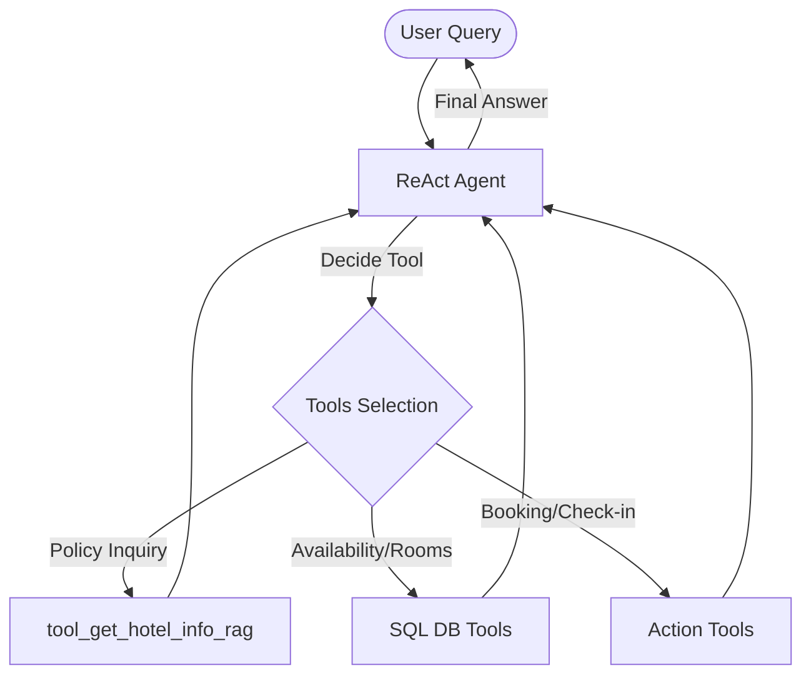

## Overview

This project presents an agentic AI system designed for hotel assistance, built with modern LLM technologies and agent frameworks. The chatbot uses LangGraph to orchestrate intelligent workflows and interact with external tools such as a PostgreSQL database and a Qdrant vector database.

By leveraging Retrieval-Augmented Generation (RAG), the system can provide accurate and context-aware answers about hotel policies, services, and frequently asked questions.

The assistant is designed to function as a digital concierge, capable of retrieving hotel information, interacting with operational data, and assisting users with tasks such as reservations or service inquiries. By combining language model reasoning with structured and unstructured data sources, the system delivers reliable responses while maintaining a natural conversational experience.

<div class="row  justify-content-sm-center ">
    <div class="col-sm mt-3 mt-md-0">
        <a href="{{ site.baseurl }}/assets/img/projects/4_multiAgent_diagram.png" data-fancybox="project" title="full pipeline" class="zoom" >
        
        </a>
    </div>
    <div class="col-sm mt-3 mt-md-0">
        
    </div>
</div>

<div class="caption">
    The general arquitecture diagram of the proposed Agentic AI sytem 
</div>

git repo here: [github](https://github.com/wild10/hotel_agent.git) 

---

### Core Capabilities

**1. Multi-Agents Processing**:
<!-- - **OCR**: Extract text from images (IDs, receipts, documents) using Tesseract + GPT-4 Vision -->
- **NLP**: Natural language understanding via OpenAI GPT-4, Gemini, Antrophic LLMs
<!-- - **Image Understanding**: Document structure parsing and validation -->

**2. RAG System**:
- Pinecone/QDrant: vector database for semantic search
- Knowledge base: hotel policies, restaurant menus, FAQs
- Context-aware information retrieval with metadata filtering

**3. Database Integration**:
- PostgreSQL for reservations, customer data, and audit logs
- Secure access with RBAC and parameterized queries
- Connection pooling and query optimization

**4. Tool Orchestration**:
- Create/cancel reservations
- Check availability and process payments
- Send confirmation emails (mcp)
<!-- - Extract information from images -->

---

### System Architecture

<!-- 
```
User Interface → API Gateway (FastAPI) → Agent Orchestration (LangChain + MCP)
                                              ↓
                    ┌─────────────────────────┼─────────────────────────┐
                    ↓                         ↓                         ↓
                LLM (GPT-4)              RAG System                OCR Engine
                    ↓                         ↓                         ↓
            PostgreSQL Database          Pinecone VectorDB/Qdrant        Image Storage (S3)
``` -->

---

### Technical Implementation

**Agent Framework**:
- **LangChain**: Agent orchestration and tool management
- **MCP (Model Context Protocol)**: Standardized tool communication
- **Advanced Prompting**: Re Act reasoning, few-shot examples

---

### Deployment Architecture

**Infrastructure**:
- **Containerization**: Docker multi-stage builds
- **Orchestration**: Kubernetes on AWS ECS
- **Database**: AWS RDS PostgreSQL with automatic backups
<!-- - **Storage**: S3 for image processing -->
- **Monitoring**: CloudWatch, LangSmith.

<!-- **Security**:
- JWT authentication and OAuth 2.0
- Encryption at rest and in transit (TLS 1.3)
- Comprehensive audit logging
- Rate limiting and DDoS protection -->

---

<!-- ### Performance Metrics

- **Response Time**: <2 seconds for 95% of queries
- **Throughput**: 1000+ requests/minute
- **Availability**: 99.95% uptime
- **OCR Accuracy**: 98%+ for printed text
- **Task Success Rate**: 94% first-attempt success -->

---

### Use Cases

**Hotel Management**:
- Automated check-in with ID verification
- Concierge services and local recommendations
- Reservation management and payment processing

**Restaurant Operations**:
- Table reservations and waitlist management
- Menu information and allergen queries
- Order processing with handwritten note OCR

---

### Technology Stack

**Core Technologies**:
- Python 3.11+, LangChain, OpenAI GPT-4
- PostgreSQL, Pinecone
- FastAPI, Docker, Kubernetes

**Infrastructure**:
- AWS (ECS, RDS, S3, lambda, CloudWatch, Secrets Manager)
<!-- - Redis (caching), Nginx (load balancing) -->
- Terraform (Infrastructure as Code)

---

### Key Achievements

This project demonstrates senior-level expertise in:
- ✅ Agentic AI systems with autonomous tool use
- ✅ Production-grade cloud deployment (AWS + Kubernetes)
- ✅ Database design with security best practices
- ✅ Advanced prompt engineering and LLM orchestration

---

*This project showcases the ability to design and deploy enterprise-grade AI systems. For collaboration or technical discussions, please [contact me](/contact/).*
